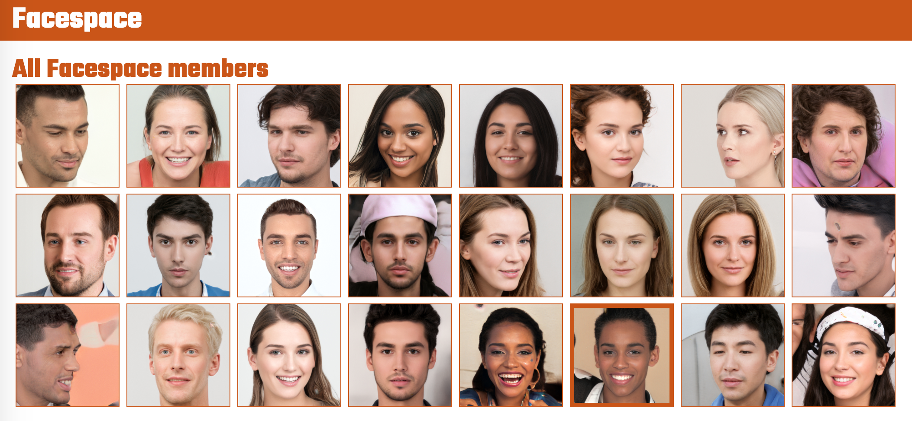
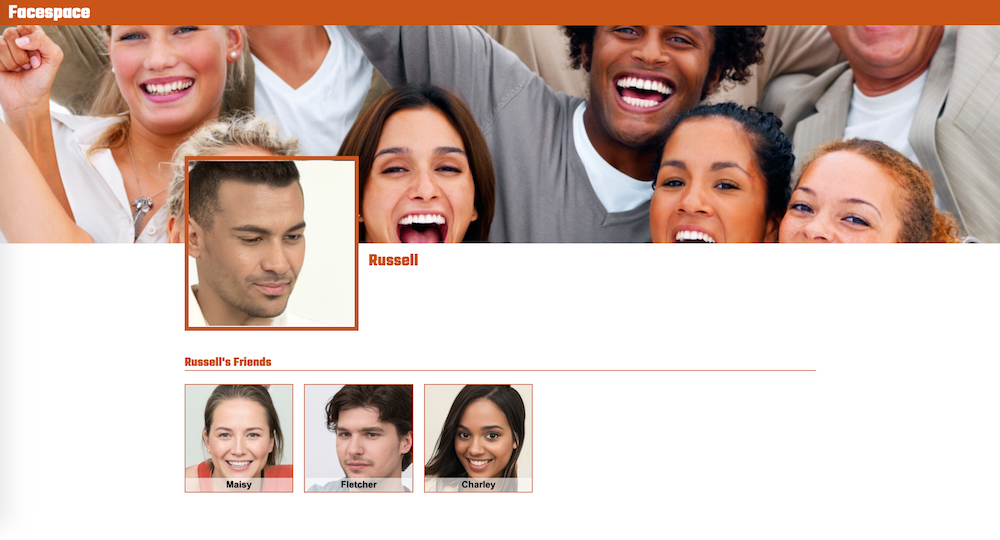

# Facespace!

## Exercise 1 - The Homepage

- Learning to create better README files with markdown.
- Screenshot for the homepage

## Exercise 2 - The Profile Page

- Screenshot for the profile page

## Exercise 3 - The Sign in page

- Screenshots for the sign in process

| Sign in                                 | Redirect to your Profile page           |
| --------------------------------------- | --------------------------------------- |
|  |  |

## Exercise 4 - Tying all of the pages together

- Display users name with greeting after sign in

- Add ribbon to friends on homepage

## Stretch Feature - Logout

- Added the ability to logout
- Updated the color palette

